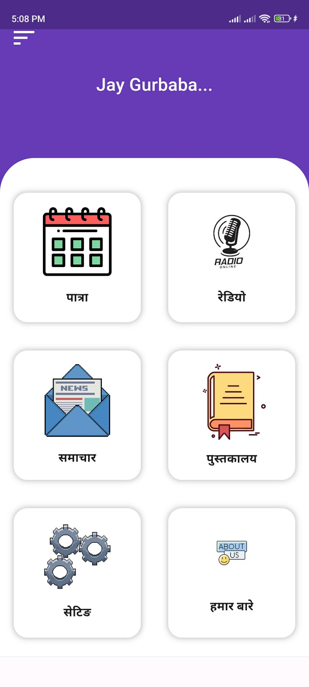
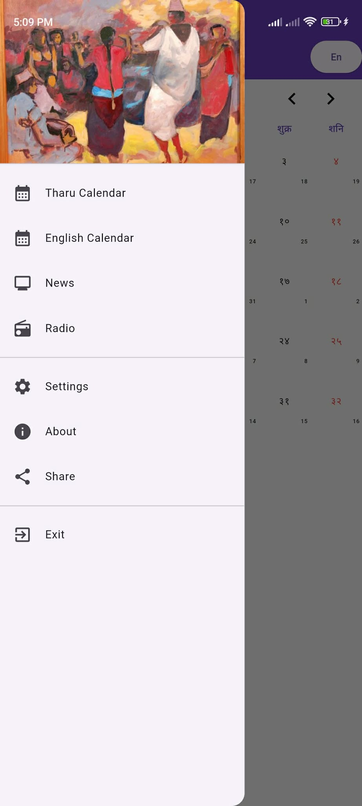
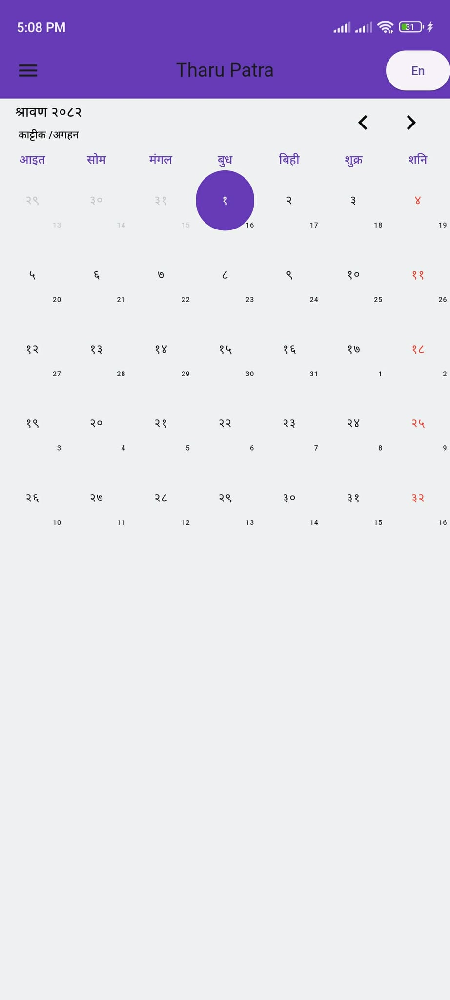
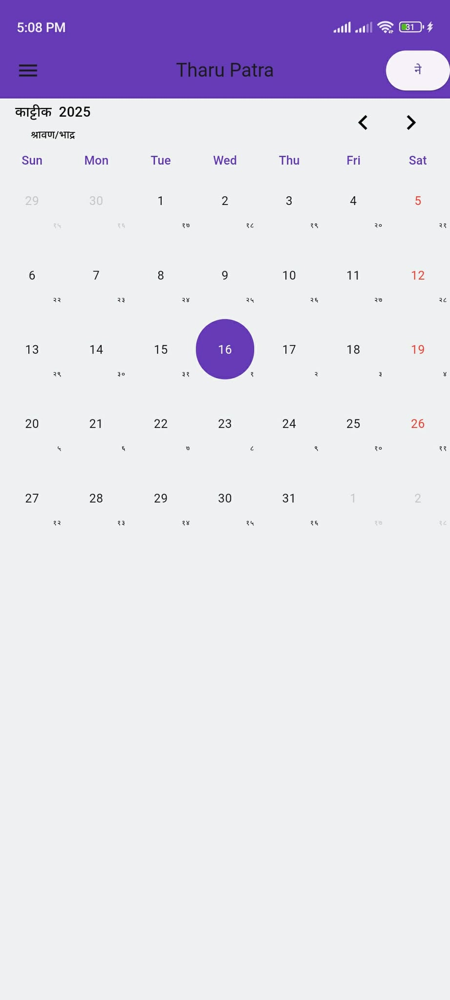

# 📅 Nepali-English Calendar App (B.S. | A.D.)

A cross-platform calendar application built using Flutter, supporting both Nepali (Bikram Sambat) and English (Gregorian) calendar systems. This app is multilingual and compatible with Android, iOS, Web, Windows, macOS, and Linux platforms.

---

## 🚀 Features

- 📆 Dual calendar system: Nepali (B.S.) and English (A.D.)

- 🌐 Multilingual UI (Nepali and English)

- 🔁 Switch seamlessly between calendar types

- 🗓️ Highlight and display holidays & events

- 🔍 Interactive date selection with event listing

- 🧭 Navigation using a custom NavBar

- 💡 Clean and modular Flutter codebase

---

## 🖼️ Screenshots

### 🏠 Home Page


### 🏠 NavBar


### 📆 Nepali(B.S) Calendar View


### 📆 English(A.D) Calendar View



---

## 🧩 Project Structure

```bash
Patra/
├── android/                 # Android native code
├── ios/                     # iOS native code
├── lib/                     # Flutter/Dart source code
│   ├── Dashboard.dart       # Main dashboard screen
│   ├── NavBar.dart          # Bottom navigation bar
│   ├── calander.dart        # Calendar logic and UI (B.S. + A.D.)
│   └── main.dart            # App entry point
├── images/                  # Assets like icons, banners, etc.
│   └── screenshots/         # App UI screenshots
├── linux/                   # Linux platform support
├── macos/                   # macOS platform support
├── web/                     # Web version setup
├── windows/                 # Windows platform support
├── pubspec.yaml             # Flutter package configuration
├── pubspec.lock             # Locked package versions
├── README.md                # Project documentation
└── .gitignore               # Git ignored files </pre>
```
---

## 🛠️ Built With
Flutter – UI toolkit for building cross-platform apps

flutter_bs_ad_calendar – For B.S. and A.D. calendar conversion

intl – Internationalization and localization support

---

## 🔧 Getting Started
### Prerequisites

- Flutter SDK installed – Get Started

- Dart SDK

- VSCode, Android Studio, Cursor


### Installation

```bash
Copy
Edit
git clone https://github.com/PatrickPC/Patro.git
cd Patro
flutter pub get
flutter run 
```

To run on the web or desktop, ensure Flutter supports those targets on your system.

---

## 📂 Usage
Navigate through the app using the bottom navigation bar. View events and holidays by selecting dates. Switch between B.S. and A.D. using calendar controls.

---

## 📌 TODO
- Add event creation

- Integrate lunar calendar support

- UI improvements and animations

- Localization improvements (date formats, number system)

---

## 🤝 Contributing
Pull requests are welcome. For major changes, please open an issue first to discuss what you would like to change.

---

## 📄 License
This project is licensed under the MIT License - see the LICENSE file for details.

---

## 🙏 Acknowledgements
Inspired by Nepali Patro apps

Calendar conversion logic powered by flutter_bs_ad_calendar